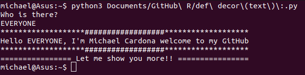

# Welcome to my profile 😎!
I'm Michael Cardona, a 30-year old Colombian who likes Raspberry Pi, Arduino and microcontrollers

I'm a tech nerd who has really passion for the mechatronic industries and their aplications
***
## Some infos about me:
* 🖥 I'm programming in python, C and C++ like fundamental key to control RPi, Arduino and Microcontroller PIC⠀I 
* 🕹⠀My passion is programming and IoT, actually I have 6 RPi and my main hobbiest are arround them
* 📍⠀I live in Medellin, Colombia
* 🏫⠀I'm an aircraft mechanic too, airplanes/helicopters
* ⠀I'm currently using RPi 2, my money capacity is short
* 🌐⠀I'm a drone pilot certified
* 📧⠀Email: **santicardonac@gmail.com**  **michaelcardonac@hotmail.com** 
***
## GitHub Stats:

***
## Links:
[ 
