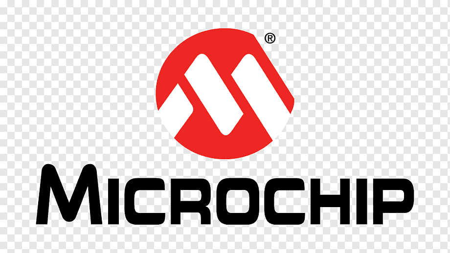

# Hello there!
[](https://www.linkedin.com/in/mikecardo)
[](mailto:santicardonac@gmail.com)
[](https://t.me/MikeCardo)
[](mailto:michaelcardonac@hotmail.com)
[](https://github.com/MikeCardo/)

## I'm Michael Cardona 👽


```python3

class MikeCardo:

    def __init__(self):
        self.username = 'MikeCardo'
        self.name = 'Michael Cardona'
        self.LinkedIn = 'linkedin.com/in/mikecardo'
        self.location = 'Medellin (Colombia)'
        self.devices = {
            'PC': { ASUS: 'Linux/Ubuntu'},
            'Processsor': { RaspberryPi: 'Python'},
            'Control': {Arduino: 'C', PIC: 'C++'},
            'Actuators': {Electronic&Electric: ['ServoMotors, Motor-Steppers, Relays, etc...']}
        }
        self.code = {
            'Programming': ['Python', 'C++', 'C'],
            'tools': ['GitHub', 'VisualStudioCode'],
            'misc': ['GNU/Linux']
        }

    def __str__(self):
        return self.name

if __name__ == '__main__':
    me = MikeCardo()
```
## 📖 Some infos about me 🔥:

<p> I'm passionate for robotics, mechatronic, IoT, OpenSource <br>
I'm a tech nerd who has really fall in love for the mechatronic industries and their aplications</p>

--- 
### 🧰 HARDWARE 
<p align="left">
  <br>
  <br>
<br> 
 
</p>

### ✏️ SOFTWARE
<p align="left">
 


 
 </p>

***
###  A little more about me... 

* ✈️⠀I'm an aircraft mechanic too, airplanes/helicopters, experience with  
* 🧰  I'm specialiced on sheet-metal structure airplanes
* 🖥⠀I'm currently using RPi 3-2, maybe a day I have a RPi4 in the future
* 🛩️⠀I'm a drone pilot certified

### Knowledges in:
<p align="left">


#### Thanks for watch:


